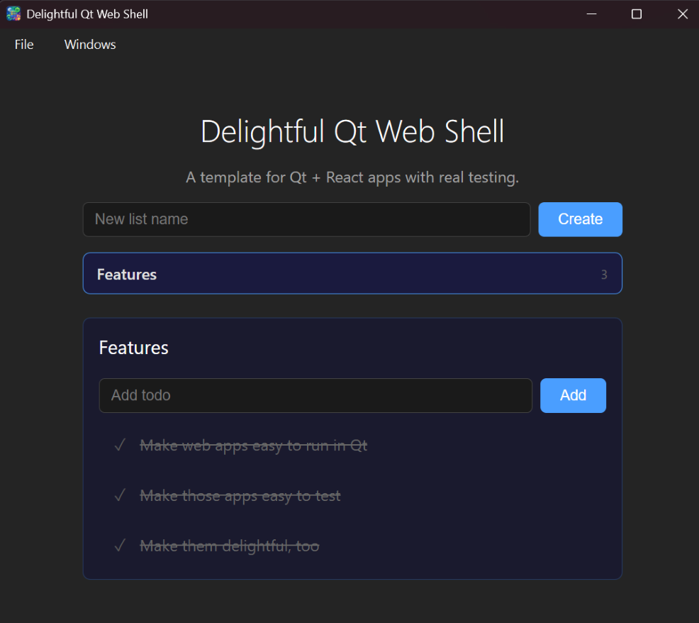

# Delightful Qt Web Shell

A template for building desktop apps with **Qt WebEngine + React** — with five layers of automated testing that actually work.



## Make It Yours

1. **Change the app name** — edit the top of `xmake.lua`:
   ```lua
   local APP_NAME    = "Your App Name"
   local APP_SLUG    = "your-app-name"
   ```
   This flows everywhere automatically: window title, binary name, Windows exe metadata, HTML title, React heading.

2. **Replace the icons** — drop your files into:
   - `resources/icon.ico` (Windows taskbar / exe icon)
   - `resources/icon.png` (loading screen logo)

3. **Optionally update `package.json`** — the `name` fields in `package.json` and `web/package.json` are npm metadata. Developers typically edit these when starting a new project.

That's it. Build and run.

## Prerequisites

- [xmake](https://xmake.io)
- [Qt 6.x](https://www.qt.io) with these modules installed:
  - **Qt WebEngine** — the Chromium-based web view
  - **Qt WebChannel** — bridge between C++ and JavaScript
  - **Qt WebSockets** — for the test server and dev/test bridge
  - **Qt Positioning** — required by WebEngine at runtime
- [Bun](https://bun.sh)
- [Node.js](https://nodejs.org) (for Playwright)
- **Linux only:** `libnss3-dev` and `libasound2-dev` (Chromium dependencies)

## Build & Run

```bash
# Configure (point to your Qt installation)
xmake f --qt=/path/to/qt  # e.g. C:/Qt/6.10.2/msvc2022_64 or ~/Qt/6.10.2/macos

# Build the desktop app (also builds the React app via Vite)
xmake build desktop

# Run it
xmake run desktop
```

## Dev Mode

For development with hot module replacement:

```bash
# Terminal 1: Vite dev server
cd web && bun run dev

# Terminal 2: Qt desktop pointing at Vite
xmake run desktop -- --dev
```

The `--dev` flag loads from `http://localhost:5173` instead of embedded resources. Edit a React component, save, see it update instantly inside the native Qt window.

For browser-only development (no Qt at all):

```bash
# Terminal 1: C++ backend over WebSocket
xmake run test-server

# Terminal 2: Vite dev server
cd web && bun run dev

# Open http://localhost:5173 in any browser
```

The React app auto-detects QWebChannel vs WebSocket — same code, both paths.

## Testing

Five layers, from fast unit tests to full Qt smoke tests:

| Layer | Command | What it proves |
|-------|---------|----------------|
| C++ unit (Catch2) | `xmake run test-todo-store` | Domain logic is correct |
| TS unit (Bun) | `xmake run test-bun` | Bridge protocol works |
| E2E (Playwright) | `xmake run test-e2e` | UI + backend integration works |
| CDP smoke | `xmake run test-smoke` | Qt actually renders the React app |
| All together | `xmake run test-all` | Everything (Catch2 + Bun + e2e) |

Install test dependencies first:

```bash
bun install
npx playwright install chromium
```

See [TESTING.md](TESTING.md) for details on each layer, or [ARCHITECTURE.md](ARCHITECTURE.md) for the zero-boilerplate bridging pattern.

## Project Structure

```
cpp/
  todo_store.hpp        Pure C++ domain logic (no Qt)
  bridge.hpp            QObject wrapper — Q_INVOKABLE methods
  expose_as_ws.hpp      Generic WebSocket adapter (QMetaObject introspection)
  test_server.cpp       Headless C++ test server (7 lines of real code)
  main.cpp              Qt desktop shell with WebEngine

web/
  src/api/bridge.ts     TodoBridge interface + WsBridge Proxy + QtBridge + auto-detect

test-server/
  server.ts             Bun WebSocket mock server (per-connection isolation)

tests/
  todo_store_test.cpp   Catch2 unit tests
  bridge_proxy_test.ts  Bun unit tests for the Proxy bridge

e2e/
  todo-lists.spec.ts    Playwright end-to-end tests (CRUD, toggle, isolation)

smoke/
  qt-renders-react.spec.ts  CDP smoke tests against real Qt app
```

## License

Use however, no attribution required.

```
BSD Zero Clause License (SPDX: 0BSD)

Permission to use, copy, modify, and/or distribute this software for any purpose
with or without fee is hereby granted.

THE SOFTWARE IS PROVIDED "AS IS" AND THE AUTHOR DISCLAIMS ALL WARRANTIES WITH
REGARD TO THIS SOFTWARE INCLUDING ALL IMPLIED WARRANTIES OF MERCHANTABILITY AND
FITNESS. IN NO EVENT SHALL THE AUTHOR BE LIABLE FOR ANY SPECIAL, DIRECT,
INDIRECT, OR CONSEQUENTIAL DAMAGES OR ANY DAMAGES WHATSOEVER RESULTING FROM LOSS
OF USE, DATA OR PROFITS, WHETHER IN AN ACTION OF CONTRACT, NEGLIGENCE OR OTHER
TORTIOUS ACTION, ARISING OUT OF OR IN CONNECTION WITH THE USE OR PERFORMANCE OF
THIS SOFTWARE.
```
